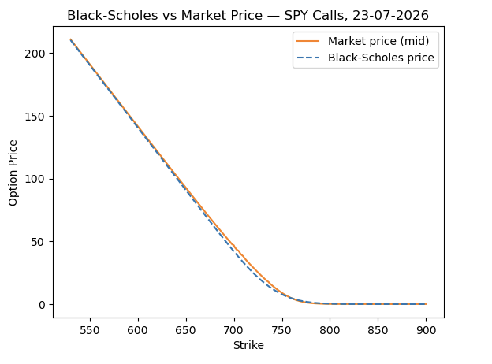

# SPY Options Pricing & Implied Volatility Smirk Model

A python tool which prices SPY options using the Black-Scholes model. Using this it calculates implied violatilty using live data and plots the volatiltiy smirk against historical volatiltiy.

## Overview

Built as a self-directed project to develop quantitative and data-analysis skills relevant to finance/quant roles — an end-to-end options-pricing pipeline running against live market data, from data ingestion through to a rendered volatility curve.

## Sample output




*Example render — the market-status annotation, spot price, and curve shape will differ each time the notebook is run, since the data is pulled live rather than from a fixed dataset.*

## What it does

- **Historical volatility** — downloads SPY daily prices (2020–present) via `yfinance` and computes 30-day rolling annualised historical volatility from daily returns
- **Market-aware spot pricing** — detects whether US markets are currently open (`pytz`, US/Eastern, weekday + 09:30–16:00 session check) and uses the live intraday price when open, or the last close when closed
- **Live options chain** — pulls the SPY options chain nearest to a 30-day expiry via `yfinance`
- **Black-Scholes pricing** — computes theoretical call/put prices from the closed-form formula (d1, d2, and the cumulative normal distribution), using the 30-day historical volatility as the volatility input
- **Implied volatility solver** — inverts the Black-Scholes formula with Brent's method (`scipy.optimize.brentq`) to back out each contract's implied volatility from its market mid-price
- **Liquidity & moneyness filtering** — restricts to OTM contracts only (calls above spot, puts below spot) with positive ask and open interest, avoiding the unstable, near-zero-vega solves that deep-ITM contracts produce
- **Volatility smirk plot** — combines the filtered puts and calls into one continuous series and plots implied volatility against strike, overlaid with historical volatility as a reference line and a status annotation (market open/closed, spot price used)

## Technical challenges

Built iteratively over several weeks; the debugging process surfaced a handful of real data-quality problems worth documenting.

**Discontinuous IV curve.** Plotting OTM puts and OTM calls as two separate series left a visible gap at the money. Fixed by combining both into a single DataFrame with `pd.concat`, sorting by strike, and plotting as one continuous line.

**Flat / stale IV readings.** Some contracts returned constant or clearly wrong implied vols, traced to stale quotes. Fixed with liquidity gates — `ask > 0` and `openInterest > 0` — applied before solving.

**Staircase artefacts in the curve.** Including deep in-the-money contracts produced jagged, non-smooth jumps in implied vol — deep-ITM options have near-zero vega, so small price noise turns into large, meaningless swings in the solved-for volatility. Fixed by restricting to OTM only (`strike >= spot` for calls, `strike <= spot` for puts).

**Solver convergence failures.** Brent's method occasionally fails to converge, typically near-zero vega or at the edges of the strike range. Wrapped in a try/except returning `NaN`, then dropped before plotting, rather than letting one bad contract crash the pipeline.

**Pre-market spot mispricing.** Using the last traded price outside market hours could misrepresent the true current spot. Added explicit market-hours detection to choose between the live intraday price and last close.

## Modeling assumptions & limitations

SPY options are American-style (early exercise permitted), while Black-Scholes assumes European-style exercise (exercise only at expiry). This is a standard simplifying approximation in practice — the early-exercise premium is typically small for underlyings with low dividend yields, and is commonly ignored in introductory and applied options-pricing work. A strictly European-style equivalent would require pricing an index option (e.g. SPX) instead, which isn't available through yfinance's options-chain endpoint.

## Tech stack

- Python, Jupyter
- `numpy`, `pandas` — data handling
- `scipy.stats.norm`, `scipy.optimize.brentq` — pricing distribution & implied-vol root-finding
- `matplotlib` — visualization
- `yfinance` — market data (spot price, historical prices, options chains)
- `pytz` — market-hours detection

## Running it

```bash
pip install numpy pandas scipy matplotlib yfinance pytz
```

Then run all cells top to bottom in Jupyter. The options chain and spot price are pulled live, so results reflect whatever SPY options are trading at runtime.

## Possible extensions

- Use the historical-vol-based theoretical price already computed to flag contracts trading rich or cheap relative to market-implied volatility
- Add the Greeks (delta, gamma, theta, vega, rho) for sensitivity analysis
- Pull a live risk-free rate (e.g. 3-month T-bill yield) instead of the current hardcoded 5%
- Swap in SPX for a genuinely European-style comparison point (would need a data source beyond yfinance, e.g. CBOE DataShop)
