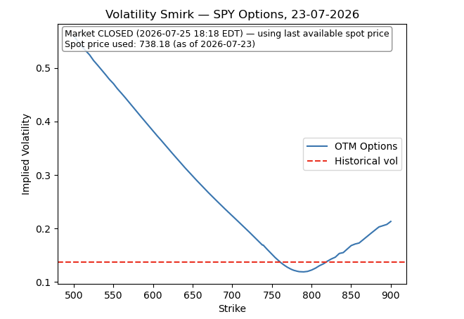

# SPY Options Pricing & Implied Volatility Smirk Model

A python tool which prices SPY options using the Black-Scholes model. Using this it calculates implied violatilty using live data and plots the volatiltiy smirk against historical volatiltiy.

## Overview

Built as a self-directed project to develop quantitative and data-analysis skills relevant to finance/quant roles — an end-to-end options-pricing pipeline running against live market data, from data ingestion through to a rendered volatility curve.

## Sample output




*Example render — the market-status annotation, spot price, and curve shape will differ each time the notebook is run, since the data is pulled live rather than from a fixed dataset.*

## What it does

- **Historical volatility** — downloads SPY daily prices (2020–present) via `yfinance` and computes 30-day rolling annualised historical volatility from daily returns
- **Market-aware spot pricing** — detects whether US markets are currently open (`pytz`, US/Eastern, weekday + 09:30–16:00 session check) and uses the live intraday price when open, or the last close when closed
- **Live options chain** — pulls the SPY options chain nearest to a 30-day expiry via `yfinance`
- **Black-Scholes pricing** — computes theoretical call/put prices from the closed-form formula (d1, d2, and the cumulative normal distribution), using the 30-day historical volatility as the volatility input
- **Implied volatility solver** — inverts the Black-Scholes formula with Brent's method (`scipy.optimize.brentq`) to back out each contract's implied volatility from its market mid-price
- **Liquidity & moneyness filtering** — restricts to OTM contracts only (calls above spot, puts below spot) with positive ask and open interest, avoiding the unstable, near-zero-vega solves that deep-ITM contracts produce
- **Volatility smirk plot** — combines the filtered puts and calls into one continuous series and plots implied volatility against strike, overlaid with historical volatility as a reference line and a status annotation (market open/closed, spot price used)

## Technical challenges

Built iteratively over several weeks; the debugging process surfaced a handful of real data-quality problems worth documenting.

**Discontinuous IV curve.** Plotting OTM puts and OTM calls as two separate series left a visible gap at the money. Fixed by combining both into a single DataFrame with `pd.concat`, sorting by strike, and plotting as one continuous line.

**Flat / stale IV readings.** Some contracts returned constant or clearly wrong implied vols, traced to stale quotes. Fixed with liquidity gates — `ask > 0` and `openInterest > 0` — applied before solving.

**Staircase artefacts in the curve.** Including deep in-the-money contracts produced jagged, non-smooth jumps in implied vol — deep-ITM options have near-zero vega, so small price noise turns into large, meaningless swings in the solved-for volatility. Fixed by restricting to OTM only (`strike >= spot` for calls, `strike <= spot` for puts).

**Solver convergence failures.** Brent's method occasionally fails to converge, typically near-zero vega or at the edges of the strike range. Wrapped in a try/except returning `NaN`, then dropped before plotting, rather than letting one bad contract crash the pipeline.

**Pre-market spot mispricing.** Using the last traded price outside market hours could misrepresent the true current spot. Added explicit market-hours detection to choose between the live intraday price and last close.

## Black-Scholes Model Assumptions

These are the assumptions that the Black-Scholes Model uses:

- The short term interest is known and is constant through time
- The stock follows a 'random walk' in continuous time with a variance rate proportional to the square of the stock price. So the distribution of possible stock prices at the end of any finite interval is log-normal and the variance rate of the return on the stock is constant.
- The stock pays no dividends or other distributions
- The option is "European" and can only be excercised at maturity.
- There are no transaction cost when buying or selling the stock or the option
- It is possible to borrow any fraction of the price of a security to buy it or to hold it, at the short-term interest rate
- There are no penalties to short selling. A seller who does not own a security will simply accept the price of the security from a buyer, and will agree to settle with the buyer on some future date by paying him an amount equal to the price of the security on that date.

## Modeling assumptions & limitations

Beyond the Black-Scholes assumptions I made the following choices when building this model

- Volatility input, Risk-free rate and time to expiry -
I use a fixed r = 0.05 instead of pulling a live risk-free rate from Treasury yields or SOFR. I did this as the true risk-free rate fluctuates and because r appears in the discounting term of the pricing formula. However using a stale or approximate rate introduces a small bias into the implied volatility I later solve for. I also fix T = 30/365 for every option in the chain, so that each contract does not have different times remaining until they expire, and I select the expiry date closest to 30 days out so T is an approximation of the time to expiry for the contract I'm using. For the initial Black-Scholes pricing, I use a single 30-day trailing historical volatility, applied across every strike. This treats historical volatility as a replacement for the market implied volatility, which I use as an assumption for the rest of the notebook until implied volatility is calculated.

- No dividend adjustment and "American style" stock -
I didn't include a dividend yield term, creating the assumption that SPY pays no dividends, even though it actually does. This is the most impactful simplification, as it skews the implied volatilities I solve for. I also price these as European-style, despite SPY options being American-style option. For calls this would not affect the result much, except that early exercise can become optimal just before an ex-dividend date. For puts the result may differ, as the incentive to exercise early comes from capturing interest on the strike price rather than from dividends.This incentive is present more persistently rather than spiking around a specific date. So the put side of my combined implied volatility curve will likely carry more approximation error than the call side.

- OTM filtering for implied volatility -
When solving for implied volatility, I only used Out-Of-The-Money options, combining OTM puts and OTM calls into a single continuous series. I made this choice because deep In-The-Money options have near-zero Vega so the Implied Volatility solver would not be able to find a unique value for the corresponding strike price. As well as this the moneyness cutoff sits exactly at the spot price, rather than using a wider band around it.


## Tech stack

- Python, Jupyter
- `numpy`, `pandas` — data handling
- `scipy.stats.norm`, `scipy.optimize.brentq` — pricing distribution & implied-vol root-finding
- `matplotlib` — visualization
- `yfinance` — market data (spot price, historical prices, options chains)
- `pytz` — market-hours detection

## Running it

```bash
pip install numpy pandas scipy matplotlib yfinance pytz
```

Then run all cells top to bottom in Jupyter. The options chain and spot price are pulled live, so results reflect whatever SPY options are trading at runtime.

## Possible extensions

- Use the historical-vol-based theoretical price already computed to flag contracts trading rich or cheap relative to market-implied volatility
- Add the Greeks (delta, gamma, theta, vega, rho) for sensitivity analysis
- Pull a live risk-free rate (e.g. 3-month T-bill yield) instead of the current hardcoded 5%
- Swap in SPX for a genuinely European-style comparison point (would need a data source beyond yfinance, e.g. CBOE DataShop)
